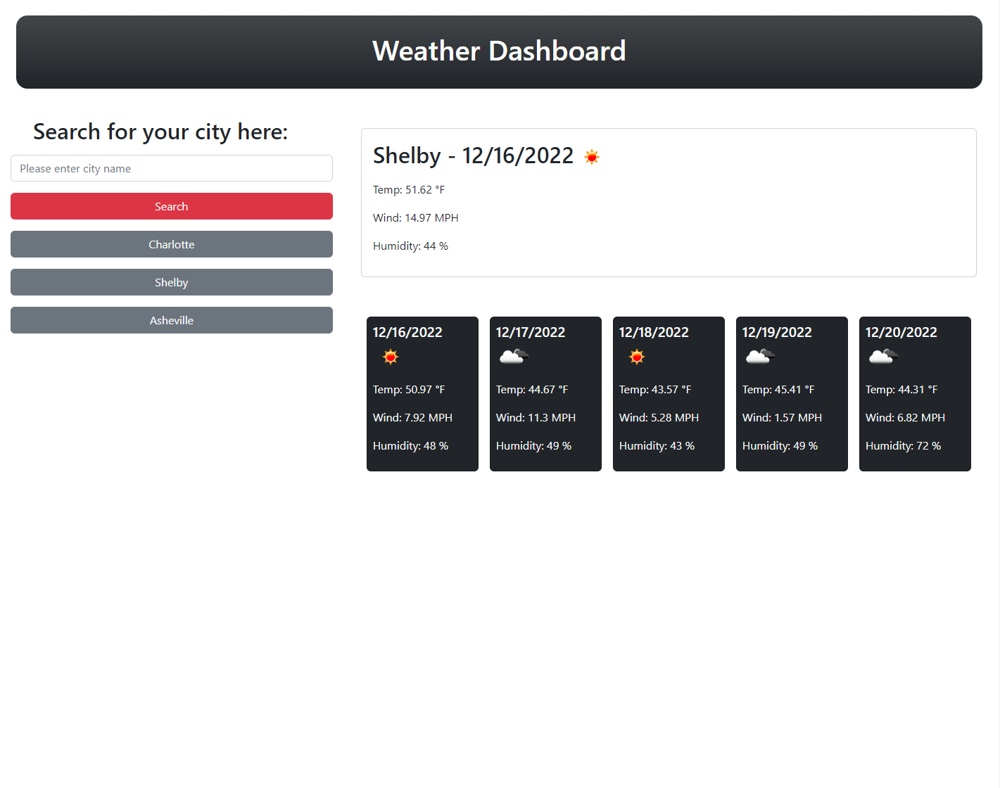

# Weather Dashboard

[Link to my project](https://smoke5643.github.io/weather-dashboard/)

## Table of Contents
- [Description](#description-of-project)
- [Visuals](#visuals)

## Description of project

This application allows a user to search for weather anywhere in the world. A current weather forecast is displayed in the main card while a 5 day forecast is also provided underneath. Every time a user searches a unique city, a button is added under the search bar that will allow them to display the data for that city again by simply clicking that button. 

## Visuals

Preview of the weather dashboard:

